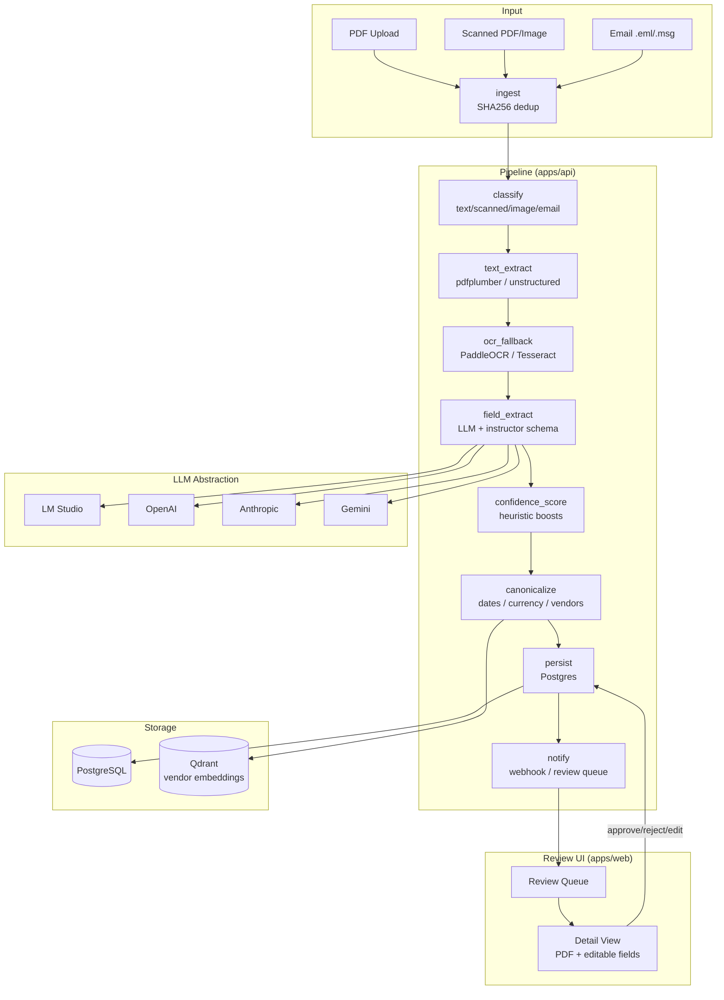

# Invoice Intelligence Pipeline

> **Created by [Aayush Dubey](https://github.com/Aayushdubey101)**

Extract, canonicalize, and human-review structured data from any invoice — PDF, scan, image, or email — with per-field confidence scoring and a side-by-side review UI.

> **North Star:** Clone, run 5 commands, have a working local demo.

```bash
git clone https://github.com/Aayushdubey101/invoice-pipeline
cd invoice-pipeline
cp .env.example .env          # pick your LLM provider
docker compose up -d          # starts postgres, qdrant, api, web
./scripts/seed.sh             # loads 12 sample invoices + vendor master
open http://localhost:3000    # review UI is live
```

---

## Features

- **Multi-provider LLM** — Ollama/LM Studio/llama.cpp (local), OpenAI, Anthropic, Gemini, Groq with auto-detection
- **Hybrid Authentication** — Zero-retention Guest Mode for quick, privacy-first testing (with randomized preview data on locked pages), or persistent Authenticated accounts via Clerk for long-term project management
- **Any input format** — text PDFs (pdfplumber), scanned PDFs + images (PaddleOCR/Tesseract), email with attachments (unstructured)
- **Per-field confidence scoring** — LLM self-reported + heuristic boosts (date parseable, math checks out, vendor matched)
- **Vendor canonicalization** — fuzzy match (rapidfuzz ≥ 90) → vector embeddings (sentence-transformers + Qdrant cosine ≥ 0.85) → new vendor flow
- **Human-in-the-loop review UI** — PDF viewer side-by-side with editable fields; yellow highlights for low-confidence fields
- **Idempotent uploads** — SHA256 deduplication; re-uploading the same file returns the cached result
- **Full audit trail** — immutable `audit_log` rows for every state transition
- **Prometheus metrics** at `/metrics`

---

## Quickstart

### Prerequisites

- Docker & Docker Compose
- An LLM provider (see [LLM Provider Setup](#llm-provider-setup))

### Steps

```bash
# 1. Clone
git clone https://github.com/your-org/invoice-intelligence
cd invoice-intelligence

# 2. Configure
cp .env.example .env
# Edit .env — set at least one LLM provider key (or leave LLM_PROVIDER=auto for LM Studio)

# 3. Start services
docker compose up -d

# 4. Seed demo data (runs migrations + loads 12 sample invoices)
./scripts/seed.sh

# 5. Open the UI
open http://localhost:3000
```

The review queue at `http://localhost:3000/review` will show invoices flagged for review.

---

## LLM Provider Setup

The pipeline auto-detects which provider to use at startup. Set `LLM_PROVIDER=auto` (default) and it checks in order:

1. Is LM Studio reachable at `LM_STUDIO_BASE_URL`? → use it
2. Is `ANTHROPIC_API_KEY` set? → use Anthropic
3. Is `OPENAI_API_KEY` set? → use OpenAI
4. Is `GEMINI_API_KEY` set? → use Gemini

Or set `LLM_PROVIDER` explicitly to skip auto-detection.

### LM Studio (local, no API key)

1. Download [LM Studio](https://lmstudio.ai)
2. Load a model (recommended: `qwen2.5-7b-instruct`)
3. Start the local server on port 1234

```ini
LLM_PROVIDER=auto
LM_STUDIO_BASE_URL=http://localhost:1234/v1
LM_STUDIO_MODEL=qwen2.5-7b-instruct
```

> When running inside Docker, change `LM_STUDIO_BASE_URL=http://host.docker.internal:1234/v1`

### OpenAI

```ini
LLM_PROVIDER=openai
OPENAI_API_KEY=sk-...
OPENAI_MODEL=gpt-4o-mini
```

Get a key at [platform.openai.com](https://platform.openai.com).

### Anthropic

```ini
LLM_PROVIDER=anthropic
ANTHROPIC_API_KEY=sk-ant-...
ANTHROPIC_MODEL=claude-sonnet-4-5
```

Get a key at [console.anthropic.com](https://console.anthropic.com).

### Google Gemini

```ini
LLM_PROVIDER=gemini
GEMINI_API_KEY=AIza...
GEMINI_MODEL=gemini-2.0-flash
```

Get a key at [aistudio.google.com](https://aistudio.google.com).

### Groq

```ini
LLM_PROVIDER=groq
GROQ_API_KEY=gsk_...
GROQ_MODEL=llama-3.3-70b-versatile
```

Get a key at [console.groq.com](https://console.groq.com).

---

## Architecture



### Key Decisions

| Decision | Choice | Reason |
|----------|--------|--------|
| LLM client | `instructor` | Schema-constrained output for all 4 providers via one API |
| Authentication | Clerk + Guest Mode | Allows frictionless onboarding (guest) while supporting persistent enterprise workspaces |
| Money types | `decimal.Decimal` | Avoid float precision loss in financial data |
| Vendor matching | rapidfuzz → Qdrant | Fast exact/fuzzy first, robust scalable vector embeddings via Qdrant |
| Pipeline errors | `document.errors[]` not raise | Partial extraction beats total failure |
| Document ID | SHA256 of file bytes | Natural deduplication key, no database round-trip |
| Audit log | Immutable INSERT only | Compliance requirement — no UPDATE/DELETE |

---

## Pipeline Stages

| Stage | What it does |
|-------|-------------|
| `ingest` | Accept file, compute SHA256, short-circuit if already processed |
| `classify` | Determine doc type: `text_pdf` / `scanned_pdf` / `image` / `email` |
| `text_extract` | pdfplumber (text PDFs), unstructured (email), stdlib fallback |
| `ocr_fallback` | PaddleOCR primary → Tesseract fallback, only if text_extract insufficient |
| `field_extract` | Single LLM call with `instructor`-enforced `Invoice` schema |
| `confidence_score` | LLM confidence + heuristics: +0.1 date parseable, +0.1 currency known, +0.2 math checks, +0.1 vendor matched |
| `canonicalize` | Dates → `YYYY-MM-DD`, currency → ISO 4217 + Decimal, vendors → canonical ID |
| `persist` | Write documents, invoices, invoice_fields, line_items, audit_log |
| `notify` | Push to review queue; optional webhook POST to `REVIEW_WEBHOOK_URL` |

---

## Extensibility

### Add a New OCR Engine

1. Create `apps/api/src/invoice_pipeline/ocr/your_engine.py`:

```python
from invoice_pipeline.ocr.base import OCREngine, OCRResult

class YourEngine:
    async def extract(self, image_bytes: bytes) -> OCRResult:
        # call your OCR library
        return OCRResult(text=..., words=[...])
```

2. Register it in `stages/ocr_fallback.py`:

```python
if settings.OCR_ENGINE == "your_engine":
    engine = YourEngine()
```

3. Add `YOUR_ENGINE` to `OCREngineName` in `config.py`.

### Add a New Vendor

```bash
# Option 1: via the Vendors page in the UI
open http://localhost:3000/vendors

# Option 2: via seed script — add to _SEED_VENDORS in apps/api/scripts/seed_vendors.py
# then re-run:
cd apps/api && uv run python scripts/seed_vendors.py
```

### Add a New LLM Provider

1. Implement `LLMProvider` protocol in `apps/api/src/invoice_pipeline/llm/your_provider.py`
2. Add detection logic to `llm/factory.py`
3. Add `your_provider` to `LLMProviderName` enum in `config.py`

---

## Configuration Reference

| Variable | Default | Description |
|----------|---------|-------------|
| `APP_ENV` | `development` | Environment name |
| `DEBUG` | `false` | Enable debug responses |
| `DATABASE_URL` | postgres://... | Async PostgreSQL URL (asyncpg driver) — point at Neon in prod with `?ssl=require` |
| `QDRANT_HOST` / `QDRANT_PORT` | `localhost` / `6333` | Local/self-hosted Qdrant |
| `QDRANT_URL` | — | Qdrant Cloud cluster URL — takes priority over host/port when set |
| `QDRANT_API_KEY` | — | Qdrant Cloud API key |
| `LLM_PROVIDER` | `auto` | `auto` \| `ollama` \| `lm_studio` \| `llamacpp` \| `openai` \| `anthropic` \| `gemini` \| `groq` |
| `LM_STUDIO_BASE_URL` | `http://localhost:1234/v1` | LM Studio endpoint |
| `LM_STUDIO_MODEL` | `qwen2.5-7b-instruct` | Model name in LM Studio |
| `OPENAI_API_KEY` | — | OpenAI API key |
| `OPENAI_MODEL` | `gpt-4o-mini` | OpenAI model name |
| `ANTHROPIC_API_KEY` | — | Anthropic API key |
| `ANTHROPIC_MODEL` | `claude-sonnet-4-5` | Anthropic model |
| `GEMINI_API_KEY` | — | Google Gemini API key |
| `GEMINI_MODEL` | `gemini-2.0-flash` | Gemini model |
| `GROQ_API_KEY` | — | Groq API key |
| `GROQ_MODEL` | `llama-3.3-70b-versatile` | Groq model |
| `LLM_TEMPERATURE` | `0.0` | Generation temperature |
| `LLM_MAX_RETRIES` | `2` | Retry count on LLM failure |
| `OCR_ENGINE` | `tesseract` | `paddleocr` \| `tesseract` |
| `LOW_CONFIDENCE_THRESHOLD` | `0.75` | Fields below this get `needs_review=true` |
| `MAX_UPLOAD_SIZE_MB` | `25` | Max file upload size |
| `REVIEW_WEBHOOK_URL` | — | POST target when invoice needs review |
| `CORS_ORIGINS` | `["http://localhost:3000"]` | Allowed CORS origins |
| `EMAIL_IMPORT_ENABLED` | `false` | Enable the optional IMAP email connector (see below) |
| `EMAIL_CONNECT_TIMEOUT_SECONDS` | `15` | IMAP connection timeout |
| `CLERK_SECRET_KEY` / `NEXT_PUBLIC_CLERK_PUBLISHABLE_KEY` | — | Clerk auth keys |
| `CLERK_JWKS_URL` / `CLERK_ISSUER` / `CLERK_AUDIENCE` | — | Clerk JWT verification |

---

## Optional: Email Import (IMAP)

Disabled by default — the pipeline is fully functional without it, and nothing
in the app imports or starts this module unless you call it yourself. Set
`EMAIL_IMPORT_ENABLED=true` in `.env`, then invoke it from a script or scheduled
job of your choosing (no automatic poller is included):

```python
from invoice_pipeline.email_connector.connector import EmailConnector

conn = EmailConnector(host="imap.gmail.com", port=993, username="me@gmail.com", password="app-password")
conn.connect()
for att in conn.fetch_unread_attachments():
    doc = await run_pipeline(
        filename=att["filename"], file_bytes=att["file_bytes"],
        mime_type=att["mime_type"], session=session,
    )
conn.disconnect()
```

Supported providers: Gmail (`imap.gmail.com:993`), Outlook (`outlook.office365.com:993`), or any generic
IMAP host. Attachments are de-duplicated by SHA-256 hash within a single `fetch_unread_attachments()` call;
across calls, dedup relies on the IMAP server's own `\Seen` flag (already-fetched messages won't be
re-returned by the `UNSEEN` search). No mandatory dependency is added — it's stdlib `imaplib` only.

**Known limitation:** there is no built-in scheduler/poller and no cross-restart durable dedup store — this
is a connector you wire into your own cron/worker, not a turnkey background feature.

---

## Production Deployment

Both Dockerfiles are non-root (`appuser`/`nextjs`) and carry a `HEALTHCHECK` hitting `/health`
(api) and `/` (web). `docker-compose.yml` is dev-oriented (host-exposed Postgres/Chroma ports,
default `invoice:invoice` DB creds, `host.docker.internal` LLM endpoints). For production, layer
`docker-compose.prod.yml` on top:

```bash
export POSTGRES_USER=... POSTGRES_PASSWORD=... POSTGRES_DB=...
export CORS_ORIGINS='["https://your-domain.com"]'
docker compose -f docker-compose.yml -f docker-compose.prod.yml up -d
```

This override:
- Requires `POSTGRES_USER`/`POSTGRES_PASSWORD`/`POSTGRES_DB`/`CORS_ORIGINS` to be set — refuses to
  start with the dev defaults instead of silently using them.
- Removes host port publishing for `postgres` and `qdrant` (api/web reach them over the internal
  compose network only).
- Adds `restart: unless-stopped` to every service.

**Authentication Note:** To deploy with full authentication, ensure you configure `NEXT_PUBLIC_CLERK_PUBLISHABLE_KEY`, `CLERK_SECRET_KEY`, `CLERK_JWKS_URL`, and `CLERK_ISSUER` as per `CLERK_SETUP.md`.

### Deploying to Render

Both `apps/api/Dockerfile` and `apps/web/Dockerfile` bind to Render's injected `$PORT` at runtime. Create two Render Web Services (Docker runtime):

- **api** — Root Directory `apps/api`, health check path `/health`. Point `DATABASE_URL` at a Neon pooled connection string (asyncpg driver, `?ssl=require`), and `QDRANT_URL`/`QDRANT_API_KEY` at a Qdrant Cloud cluster instead of the local host/port pair.
- **web** — Root Directory `apps/web`. `NEXT_PUBLIC_*` vars (`NEXT_PUBLIC_API_URL`, Clerk keys) must be marked **"Available at build time"** — Next.js bakes them into the client bundle at build, not at runtime.

Deploy the api service first, then set `NEXT_PUBLIC_API_URL` on web and `CORS_ORIGINS` on api to each other's Render URLs.

---

## Troubleshooting

**LM Studio not detected / `NoLLMProviderConfigured`**

Ensure LM Studio is running with a model loaded and the server started on port 1234. Test with:
```bash
curl http://localhost:1234/v1/models
```
If running in Docker, set `LM_STUDIO_BASE_URL=http://host.docker.internal:1234/v1`.

---

**`Connection refused` on Postgres**

Docker hasn't finished starting. Wait a few seconds and retry:
```bash
docker compose ps   # check all services are "healthy"
```

---

**PaddleOCR install fails on Apple Silicon (M1/M2/M3)**

PaddlePaddle doesn't support arm64 directly. Use Tesseract instead:
```ini
OCR_ENGINE=tesseract
```
Or install via Rosetta: `arch -x86_64 pip install paddlepaddle`.

---

**`pnpm install` fails with `ERR_PNPM_FROZEN_LOCKFILE`**

Run with:
```bash
cd apps/web && pnpm install --no-frozen-lockfile
```

---

**`react-pdf` shows blank PDF / worker error**

Ensure `.npmrc` has `public-hoist-pattern[]=pdfjs-dist`. Then re-run `pnpm install`.

---

**Seed script hangs waiting for API**

The API might not have started yet. Check:
```bash
docker compose logs api --tail=50
```
Wait for `Application startup complete` before running `./scripts/seed.sh`.

---

## Makefile Targets

```bash
make setup      # copy .env.example, install all deps
make dev        # start postgres+chroma in docker, run api+web locally
make up         # docker compose up -d (all services)
make down       # docker compose down
make migrate    # run alembic upgrade head
make seed       # run ./scripts/seed.sh
make test       # run backend pytest with coverage
make test-web   # run frontend vitest
make lint       # ruff + mypy + eslint
make format     # ruff format + prettier
make clean      # docker compose down -v + remove build artifacts
```

---

## Roadmap

- [ ] Batch upload via CLI / folder watch
- [x] Email import (IMAP connector — optional, manual invocation, see Configuration Reference)
- [ ] Automatic email polling / scheduler for the IMAP connector
- [ ] Multi-page line item extraction improvements
- [ ] Webhook signature verification
- [ ] Export to CSV / accounting system integrations (QuickBooks, Xero)
- [ ] Role-based access control for review UI
- [ ] Rate-per-provider cost tracking dashboard
- [ ] `run_batch.py` CLI for offline batch processing

---

## Contributing

1. Fork the repo and create a feature branch
2. Follow the TDD approach: write tests first
3. Ensure `make test` and `make lint` both pass
4. Submit a PR with a clear description of the change

Commit style: [Conventional Commits](https://www.conventionalcommits.org/) (`feat:`, `fix:`, `chore:`, etc.)

---

## Author

**Aayush Dubey** — [GitHub](https://github.com/Aayushdubey101)

## License

MIT — see [LICENSE](LICENSE).
